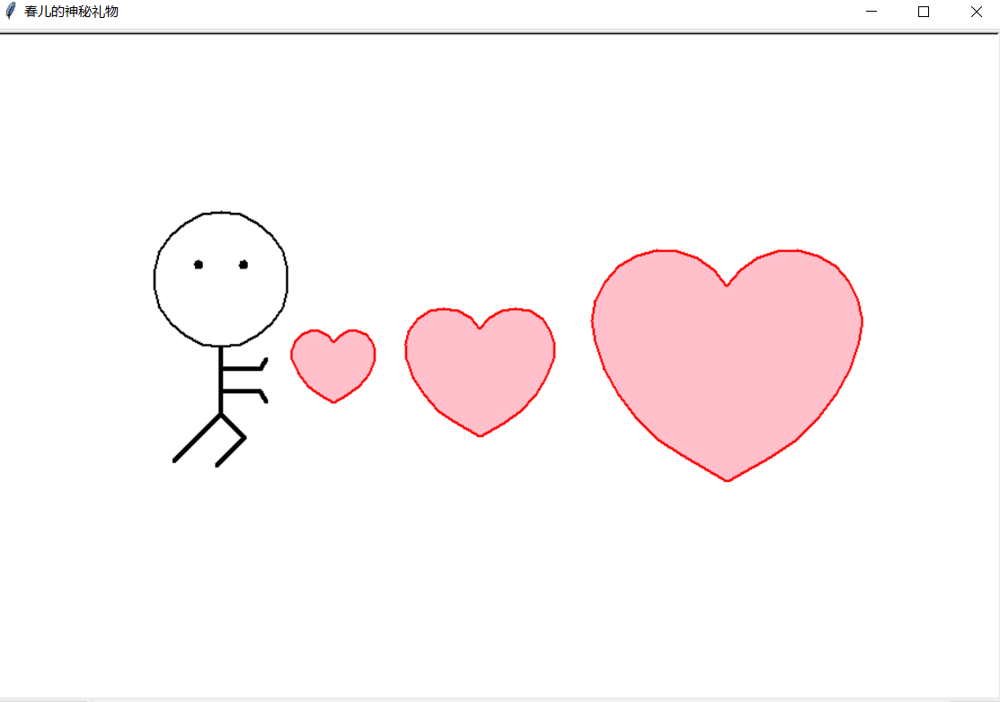
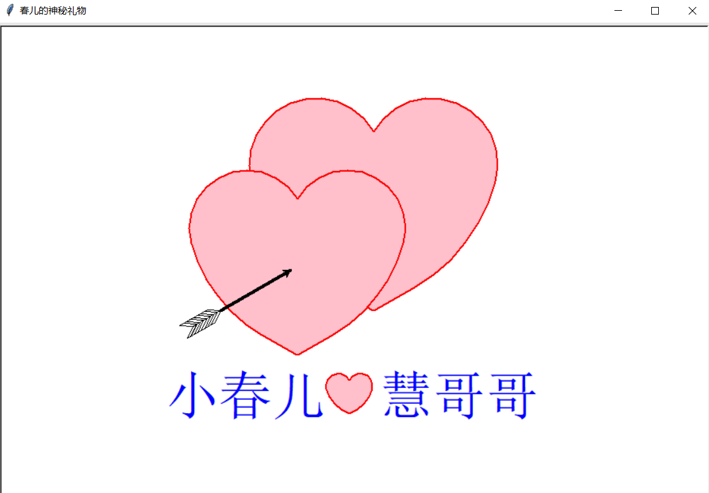

# 序言

本文是献给小春儿的第一份礼物，春儿之前说，想做数据分析，是因为喜欢把数据转成可视化的那种神奇能力，觉着很厉害。坦白的讲，我对python也不太熟，就连语法其实也并没有真正意义上学过一遍，只是偶尔会用python写一点小脚本。 记得前阵子去中兴面试，一面的主管(一个大姐姐)，边翻简历边问，还会python? 我说：“会一点点，但是只用python写过简单的脚本，对OpenCV，机器学习那些都不懂”。那个大姐姐笑着说，那就是不会嘛。我尴尬跟她一笑，“确实可以说不会”。

至于数据分析领域，我更是没有接触过(后面慢慢学啦)，所以本文和数据分析无关，只是一个简单的绘图动画，很简陋，希望春儿能喜欢啦。

# turtle库

既然用python，又想跟可视化有关，网上搜了一些资料，最终锁定了**turtle**库---又称海龟绘图。

turtle官方文档地址：[https://docs.python.org/zh-cn/3/library/turtle.html#turtle.title](https://docs.python.org/zh-cn/3/library/turtle.html#turtle.title)

关于这个库，官网的描述是：

“海龟绘图很适合用来引导孩子学习编程。 最初来自于 Wally Feurzeig, Seymour Papert 和 Cynthia Solomon 于 1967 年所创造的 Logo 编程语言。 请想象绘图区有一只机器海龟，起始位置在**xOy平面**的 (0, 0) 点。先执行  `import turtle` ，再执行  `turtle.forward(15)` ，它将(在屏幕上)朝所面对的 x 轴正方向前进 15 像素，**随着它的移动画出一条线段**。再执行 `turtle.right(25)`，它将**原地右转 25 度**。”

通过组合使用此类命令，可以轻松地绘制出精美的形状和图案。

turtle 模块提供面向对象和面向过程两种形式的海龟绘图基本组件。由于它使用 tkinter 实现基本图形界面，因此**需要安装了 Tk 支持的 Python 版本**。(我用的是python 3.9版本)

关于turtle库具体的使用细节，官方文档有详细介绍，这里就不多写了。(春儿对这个库感兴趣的话哥哥可以教你呀)

# 灵魂画师

说了半天好像还没说这到底是个啥功能，其实很简单，就是使用turtle库绘制的一些图形，部分截图如下：

当然，代码是抄的别人的，不过调整了一些细节，比如初始窗口的位置，窗口的大小调大了一些，绘图的位置调整的更有协调性，以及里面的文字部分。

抄的东西，总感觉少了一些新意，不知道春儿会不会笑话我，本来想着自己再画个笛卡尔心形函数，笛卡尔啊，大数学家，心形函数，多浪漫。但是仔细瞅了一眼发现数学实在遗忘的太多，再加上笛卡尔那个函数有点难度的其实，最关键的笛卡尔绘制出来话，和前面那个心长的其实差不多，再画的话好像多此一举了，就没画了，不过可以和春儿讲讲笛卡尔的爱情故事，那倒是挺感人的。

# 使用

有**两种方式**执行该程序：

一、在love.py所在目录下，终端执行 `python love.py` 即可。

二、或者直接双击执行love.exe文件。